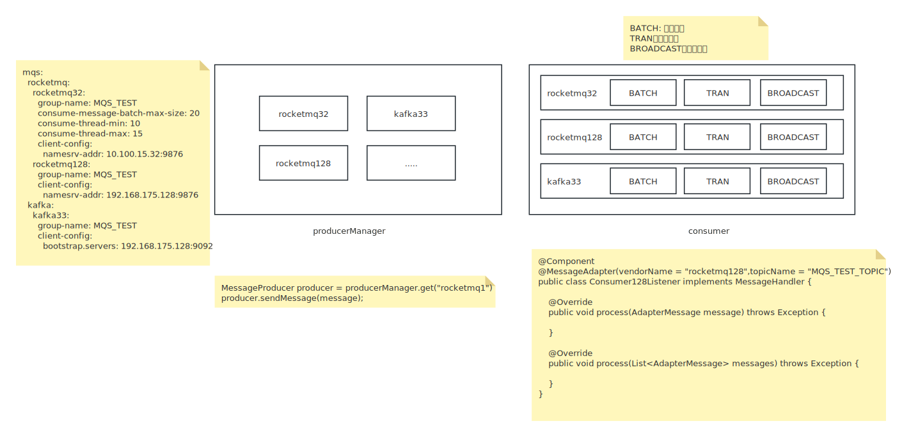

# mqs-adapter

> 消息中间件适配器



## 功能清单

- 目前支持rocketmq和kafka两种消息中间件。
- 支持多数据源
- 支持多种消费模式，批量消费，单条消费，广播消费
- 支持对消费组名称和topic名称做转换处理 --1.0.5新增
- 支持默认实例（默认数据源，可以不配置实例ID）--1.0.5新增

## 使用说明

### 引入依赖

```xml
<dependency>
    <groupId>com.hzwq.starter</groupId>
    <artifactId>mqs-starter</artifactId>
    <version>1.0.5</version>
</dependency>
```

### 配置清单及示例

> 下面配置示例中一共定义了四个消息中间件实例，分别是default、rocketmqInstance01、rocketmqInstance02、kafkaInstance

```yaml
mqs:
  adapter:
    default: # 实例ID，default为默认实例，MessageAdapter注解中可以不填写实例ID
      group-name: MQS_TEST  # 消费组默认名称，必填项
      vendor-name: kafka  # 组件厂商名称，必填项
      consumer-enabled: true  # 消费者开关
      producer-enabled: true  # 生产者开关
      group: #消费组名称转换配置
        prefix: GID-  # 消费组名称前缀
#        suffix: -gid  # 消费组名称后缀
        upper-to-lower: true # 大写转小写
        under-score-to-hyphen: true # 下划线转中划线
#        lower-to-upper: false # 小写转大写
#        hyphen-to-under-score: false # 中划线转下划线
      topic: #主题名称转换配置
        prefix: TID-  # 主题名称前缀
#        suffix: -tid  # 主题名称后缀
        upper-to-lower: true # 大写转小写
        under-score-to-hyphen: true # 下划线转中划线
#        lower-to-upper: false # 小写转大写
#        hyphen-to-under-score: false # 中划线转下划线
      kafka: #kafka专属配置
        client-config: # kafka客户端源生配置，可自行参阅官网文档配置
          bootstrap.servers: 10.100.11.33:9092 # kafka集群地址
          max.poll.records: 20  #批量消费上限
#          security.protocol: SASL_PLAINTEXT  # 可以配置安全协议，实现sasl+acl认证，kafka原生配置，自行研究怎么配
#          sasl.mechanism: SCRAM-SHA-256
#          sasl.jaas.config: org.apache.kafka.common.security.scram.ScramLoginModule required username="admin" password="admin-secret";
    kafka02: # 实例ID
      group-name: MQS_TEST  # 消费组默认名称，必填项
      vendor-name: kafka  # 组件厂商名称，必填项
      consumer-enabled: true  # 消费者开关
      producer-enabled: true  # 生产者开关
      kafka: #kafka专属配置
        client-config: # kafka客户端源生配置，可自行参阅官网文档配置
          bootstrap.servers: 192.168.175.128:9092,192.168.175.128:19092,192.168.175.128:29092 # kafka集群地址
          max.poll.records: 20  #批量消费上限
    rocketmq01: # 实例ID
      group-name: MQS_TEST_01  # 消费组默认名称，必填项
      vendor-name: rocketmq # 组件厂商名称，必填项
      consumer-enabled: true # 消费者开关
      producer-enabled: true # 生产者开关
      group: #消费组名称转换配置
        prefix: GID-  # 消费组名称前缀
        upper-to-lower: true # 大写转小写
        under-score-to-hyphen: true # 下划线转中划线
      topic: #主题名称转换配置
        prefix: TID-  # 主题名称前缀
        upper-to-lower: true # 大写转小写
        under-score-to-hyphen: true # 下划线转中划线
      rocketmq: #rocketmq专属配置
        consume-message-batch-max-size: 20  # 批量消费上限，建议不超过32
        consume-thread-min: 10  # 消费消息最小线程
        consume-thread-max: 15  # 消费消息最大线程
        client-config: # rocketmq客户端源生配置，可自行参阅官网文档配置
          namesrv-addr: 192.168.175.128:9876 #rocketmq集群地址
#        acl:
#          enabled: true # 是否开启acl认证
#          secret-key: XXXXXXXXXX
#          access-key: XXXXXXXXXX
    rocketmq02: # 实例ID
      group-name: MQS_TEST_02  # 消费组默认名称，必填项
      vendor-name: rocketmq # 组件厂商名称，必填项
      consumer-enabled: true # 消费者开关
      producer-enabled: true # 生产者开关
      rocketmq: #rocketmq专属配置
        consume-message-batch-max-size: 20  # 批量消费上限，建议不超过32
        consume-thread-min: 10  # 消费消息最小线程
        consume-thread-max: 15  # 消费消息最大线程
        client-config: # rocketmq客户端源生配置，可自行参阅官网文档配置
          namesrv-addr: 10.100.15.32:9876 #rocketmq集群地址
```

### 消息体说明

> mqs-adapter对rocketmq和kafka的消息实体做了一层适配处理，将消息内容中共有的属性提取到AdapterMessage中。

以下是AdapterMessage消息实体的属性说明

| 属性名称      | 属性类型 | 属性说明                                         |
| ------------- | -------- | ------------------------------------------------ |
| topic         | String   | 消息主题                                         |
| tag           | String   | 消息标签 注：kafka不支持该属性                   |
| bizKey        | String   | 键                                               |
| body          | byte[]   | 消息体，为了统一类型，统一将消息体定义为字节类型 |
| processTime   | Long     | 消息处理时间                                     |
| msgId         | String   | 消息唯一标识                                     |
| consumeTimes  | int      | 消费时间                                         |
| originMessage | Object   | 原始消息，可自行转换解析                         |

### 生产者使用

#### 获取生产者实例

```java
	// 注入生产者管理器
    @Autowired
    ProducerManager producerManager;
...
    // 获取默认实例
   	MessageProducer defaultProducer = producerManager.getDefaultInstance();
	// 根据实例ID获取指定实例
	// MessageProducer producer = producerManager.get(instanceId);
...
```

#### 发送同步消息

```java
	// 获取生产者实例
	MessageProducer producer = producerManager.get(instanceId);
	// 构建消息体 
	AdapterMessage message = AdapterMessage.builder()
        						.topic(topic)
        						.body("This is a sync message".getBytes(StandardCharsets.UTF_8))
        						.build();
	// 调用同步发送消息方法，并接受发送消息结果
    MessageSendResult send = producer.sendMessage(message);
	// 发送结果处理
    if (send.getStatus() == Consts.SUCCESS) logger.info("消息同步发送成功");
    else logger.info("消息同步发送失败,原因:" + send.getThrowable().getMessage());
```

#### 发送异步消息

```java
	// 获取生产者实例
	MessageProducer producer = producerManager.get(instanceId);
	// 构建消息体 
	AdapterMessage message = AdapterMessage.builder()
        						.topic(topic)
        						.body("This is a sync message".getBytes(StandardCharsets.UTF_8))
        						.build();
	// 异步发送消息，传入消息发送结果处理回调
	producer.sendMessage(message, new MessageCallback() {
                @Override
                public void onSuccess() {
                    logger.info("消息异步发送成功");
                }

                @Override
                public void onError(Throwable throwable) {
                    logger.info("消息异步发送失败,原因:" + throwable.getMessage());
                }
            });
```

#### 发送单向消息

```java
	// 获取生产者实例
	MessageProducer producer = producerManager.get(instanceId);
	// 构建消息体 
	AdapterMessage message = AdapterMessage.builder()
        						.topic(topic)
        						.body("This is a sync message".getBytes(StandardCharsets.UTF_8))
        						.build();
	// 发送单向消息
	producer.sendOneWay(message);
```

### 消费者使用

使用@MessageAdapter注解，声明使用的实例ID、topic。

实现MessageHandler接口，**并将监听实现注入到Spring容器中**。

> **instanceId在1.0.4版本之后非必填项，默认为default实例。**

#### 单条消费示例
```java
@Component
@MessageAdapter(instanceId = "kafka33",topicName = "MQS_TEST_TOPIC")
public class ConsumerListener implements MessageHandler {

    private static final Logger logger = LoggerFactory.getLogger(ConsumerListener.class);
    
    @Override
    public void process(AdapterMessage message) throws Exception {
        logger.info("收到消息，TOPIC：{}，消息内容是：{}", message.getTopic(), new String(message.getBody(), StandardCharsets.UTF_8));
    }

    @Override
    public void process(List<AdapterMessage> messages) throws Exception {

    }
}
```

#### 批量消费示例
```java
@Component
@MessageAdapter(instanceId = "kafka33",topicName = "MQS_TEST_TOPIC_BATCH", isBatch = true)
public class BatchConsumerListener implements MessageHandler {

    private static final Logger logger = LoggerFactory.getLogger(BatchConsumerListener.class);
    
    @Override
    public void process(AdapterMessage message) throws Exception {

    }

    @Override
    public void process(List<AdapterMessage> messages) throws Exception {
        logger.info("监听到批量消息，消息总数为：{}", messages.size());
        messages.forEach(message -> {
            logger.info("收到消息，TOPIC：{}，消息内容是：{}", message.getTopic(), new String(message.getBody(), StandardCharsets.UTF_8));
        });
    }
}
```
#### 广播消费示例
```java
@Component
@MessageAdapter(instanceId = "kafka33",topicName = "MQS_TEST_TOPIC_BROADCAST", isBroadcast = true)
public class BroadcastConsumerListener implements MessageHandler {

    private static final Logger logger = LoggerFactory.getLogger(BroadcastConsumerListener.class);

    @Override
    public void process(AdapterMessage message) throws Exception {
        logger.info("收到消息，TOPIC：{}，消息内容是：{}", message.getTopic(), new String(message.getBody(), StandardCharsets.UTF_8));
    }

    @Override
    public void process(List<AdapterMessage> messages) throws Exception {

    }
}
```
#### 批量广播消费示例
```java
@Component
@MessageAdapter(instanceId = "kafka33",topicName = "MQS_TEST_TOPIC_BATCH_BROADCAST", isBatch = true, isBroadcast = true)
public class BatchBroadcastConsumerListener implements MessageHandler {

    private static final Logger logger = LoggerFactory.getLogger(BatchBroadcastConsumerListener.class);

    @Override
    public void process(AdapterMessage message) throws Exception {

    }

    @Override
    public void process(List<AdapterMessage> messages) throws Exception {
        logger.info("监听到批量消息，消息总数为：{}", messages.size());
        messages.forEach(message -> {
            logger.info("收到消息，TOPIC：{}，消息内容是：{}", message.getTopic(), new String(message.getBody(), StandardCharsets.UTF_8));
        });
    }
}
```
### 注意事项
- rocketmq消费者使用push的方式实现，通过实现并发消费监听类MessageListenerConcurrently实现的消息监听
- kafka消费者使用poll的方式实现，使用自定义线程池拉取消息，目前仅支持自动提交消费位点，后续看情况扩展
- 目前支持设置批量消费和广播消费，因此每个消费实例下面都会存在批量消费组合广播消费组
- **rocketmq的消费组需要创建（生产环境一般都会要求关闭自动创建）**，**创建消费组时需要同时创建批量消费组和广播消费组**，例如：MQS_TEST(消费组)，在创建消费组MQS_TEST时，如果该消费组下会有批量消费和广播消费的需求，那么此时需要另外再创建MQS_TEST_BATCH(批量消费组)、MQS_TEST_BROADCAST(广播消费组)两个消费组。
- rocketmq的消费策略为CONSUME_FROM_LAST_OFFSET
- kafka的消费策略为latest
- 由于AMQP协议天生不支持批量消费，后续可能不会支持rabbitmq和activemq组件（最多支持单条消费）
