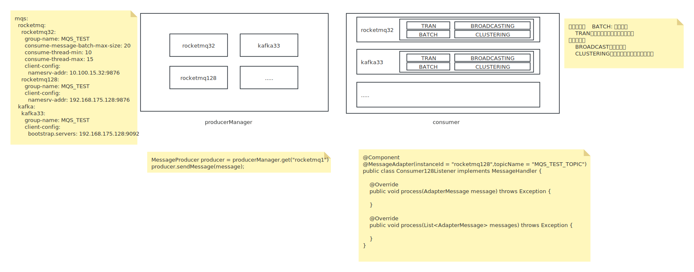

# mqs-adapter

> 消息中间件适配器



## 功能清单

- 目前支持rocketmq和kafka两种消息中间件。
- 支持多数据源
- 支持多种消费模式，批量消费，单条消费，广播消费

## 使用说明

### 引入依赖

```xml
<dependency>
    <groupId>org.yinqin</groupId>
    <artifactId>mqs-starter</artifactId>
    <version>1.0.3</version>
</dependency>
```

### 配置定义

```yaml
mqs:
  adapter:
    rocketmq128:  # 实例ID
      group-name: MQS_TEST  # 消费组默认名称，必填项
      vendor-name: rocketmq # 组件厂商名称，必填项
      consumer-enabled: true # 消费者开关
      producer-enabled: true # 生产者开关
      rocketmq: #rocketmq专属配置
        consume-message-batch-max-size: 20  # 批量消费上限，建议不超过32
        consume-thread-min: 10  # 消费消息最小线程
        consume-thread-max: 15  # 消费消息最大线程
        client-config:  # rocketmq客户端源生配置，可自行参阅官网文档配置
          namesrv-addr: 192.168.175.128:9876
    #        acl: # 商业版rocketmq acl认证配置
    #          enabled: true # acl开关
    #          access-key:
    #          secret-key:
    kafka33:  # 实例ID
      group-name: MQS_TEST  # 消费组默认名称，必填项
      vendor-name: kafka  # 组件厂商名称，必填项
      consumer-enabled: true  # 消费者开关
      producer-enabled: true  # 生产者开关
      kafka:  #kafka专属配置
        client-config:  # kafka客户端源生配置，可自行参阅官网文档配置
          bootstrap.servers: 192.168.175.128:9092,192.168.175.128:19092,192.168.175.128:29092 # kafka集群地址
          max.poll.records: 20  #批量消费上限
```

### 生产者使用

```java
@RestController
public class MqAdapterTestController {
    private static final Logger logger = LoggerFactory.getLogger(MqAdapterTestController.class);

    @Autowired
    ProducerManager producerManager;

    @GetMapping("/pubMessage")
    public void pubMessage(@RequestParam String topic, // topic
                           @RequestParam Integer pubCount, 
                           @RequestParam String pubMode, // 发送消息模式，同步、异步、单向
                           @RequestParam String instanceId) { //实例ID
        switch (pubMode) {
            case MessagePubMode.SYNC:
                syncPubMessage(topic, pubCount, producerManager.get(instanceId));
                break;
            case MessagePubMode.ASYNC:
                asyncPubMessage(topic, pubCount, producerManager.get(instanceId));
                break;
            case MessagePubMode.ONE_WAY:
                oneWayPubMessage(topic, pubCount, producerManager.get(instanceId));
                break;
            default:
                logger.info("未支持的发送消息模式：{}", pubMode);
                break;
        }
    }

    private void oneWayPubMessage(String topic, Integer pubCount,MessageProducer producer) {
        for (int i = 0; i < pubCount; i++){
            AdapterMessage message = AdapterMessage.builder().topic(topic).body("This is a one way message".getBytes(StandardCharsets.UTF_8)).build();
            producer.sendOneWay(message);
        }
    }

    private void asyncPubMessage(String topic, Integer pubCount,MessageProducer producer) {
        for (int i = 0; i < pubCount; i++) {
            AdapterMessage message = AdapterMessage.builder().topic(topic).body("This is a async message".getBytes(StandardCharsets.UTF_8)).build();
            producer.sendMessage(message, new MessageCallback() {
                @Override
                public void onSuccess() {
                    logger.info("消息异步发送成功");
                }

                @Override
                public void onError(Throwable throwable) {
                    logger.info("消息异步发送失败,原因:" + throwable.getMessage());
                }
            });
        }
    }

    private void syncPubMessage(String topic, Integer pubCount,MessageProducer producer) {
        for (int i = 0; i < pubCount; i++) {
            AdapterMessage message = AdapterMessage.builder().topic(topic).body("This is a sync message".getBytes(StandardCharsets.UTF_8)).build();
            MessageSendResult send = producer.sendMessage(message);
            if (send.getStatus() == Consts.SUCCESS) logger.info("消息同步发送成功");
            else logger.info("消息同步发送失败,原因:" + send.getThrowable().getMessage());
        }
    }
}
```

### 消费者使用

使用@MessageAdapter注解，声明使用的实例ID、topic。

实现MessageHandler接口即可。

#### 单条消费示例
```java
@Component
@MessageAdapter(instanceId = "kafka33",topicName = "MQS_TEST_TOPIC")
public class ConsumerListener implements MessageHandler {

    private static final Logger logger = LoggerFactory.getLogger(ConsumerListener.class);
    
    @Override
    public void process(AdapterMessage message) throws Exception {
        logger.info("收到消息，TOPIC：{}，消息内容是：{}", message.getTopic(), new String(message.getBody(), StandardCharsets.UTF_8));
    }

    @Override
    public void process(List<AdapterMessage> messages) throws Exception {

    }
}
```

#### 批量消费示例
```java
@Component
@MessageAdapter(instanceId = "kafka33",topicName = "MQS_TEST_TOPIC_BATCH", isBatch = true)
public class BatchConsumerListener implements MessageHandler {

    private static final Logger logger = LoggerFactory.getLogger(BatchConsumerListener.class);
    
    @Override
    public void process(AdapterMessage message) throws Exception {

    }

    @Override
    public void process(List<AdapterMessage> messages) throws Exception {
        logger.info("监听到批量消息，消息总数为：{}", messages.size());
        messages.forEach(message -> {
            logger.info("收到消息，TOPIC：{}，消息内容是：{}", message.getTopic(), new String(message.getBody(), StandardCharsets.UTF_8));
        });
    }
}
```
#### 广播消费示例
```java
@Component
@MessageAdapter(instanceId = "kafka33",topicName = "MQS_TEST_TOPIC_BROADCAST", isBroadcast = true)
public class BroadcastConsumerListener implements MessageHandler {

    private static final Logger logger = LoggerFactory.getLogger(BroadcastConsumerListener.class);

    @Override
    public void process(AdapterMessage message) throws Exception {
        logger.info("收到消息，TOPIC：{}，消息内容是：{}", message.getTopic(), new String(message.getBody(), StandardCharsets.UTF_8));
    }

    @Override
    public void process(List<AdapterMessage> messages) throws Exception {

    }
}
```
#### 批量广播消费示例
```java
@Component
@MessageAdapter(instanceId = "kafka33",topicName = "MQS_TEST_TOPIC_BATCH_BROADCAST", isBatch = true, isBroadcast = true)
public class BatchBroadcastConsumerListener implements MessageHandler {

    private static final Logger logger = LoggerFactory.getLogger(BatchBroadcastConsumerListener.class);

    @Override
    public void process(AdapterMessage message) throws Exception {

    }

    @Override
    public void process(List<AdapterMessage> messages) throws Exception {
        logger.info("监听到批量消息，消息总数为：{}", messages.size());
        messages.forEach(message -> {
            logger.info("收到消息，TOPIC：{}，消息内容是：{}", message.getTopic(), new String(message.getBody(), StandardCharsets.UTF_8));
        });
    }
}
```
### 注意事项
- rocketmq消费者使用push的方式实现，通过实现并发消费监听类MessageListenerConcurrently实现的消息监听
- kafka消费者使用poll的方式实现，使用自定义线程池拉取消息，目前仅支持自动提交消费位点，后续看情况扩展
- 目前支持设置批量消费和广播消费，因此每个消费实例下面都会存在批量消费组合广播消费组
- 创建消费组时需要同时创建批量消费组和广播消费组，例如：MQS_TEST(消费组)，MQS_TEST_BATCH(批量消费组)、MQS_TEST_BROADCAST(广播消费组)
- rocketmq的消费策略为CONSUME_FROM_LAST_OFFSET
- kafka的消费策略为latest
- 由于AMQP协议天生不支持批量消费，后续可能不会支持rabbitmq和activemq组件（最多支持单条消费）
